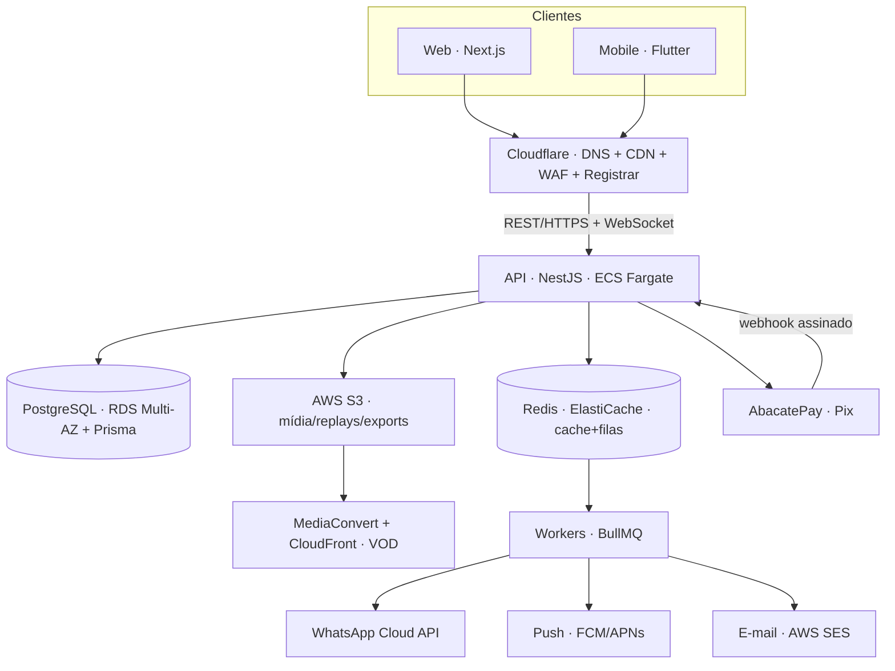
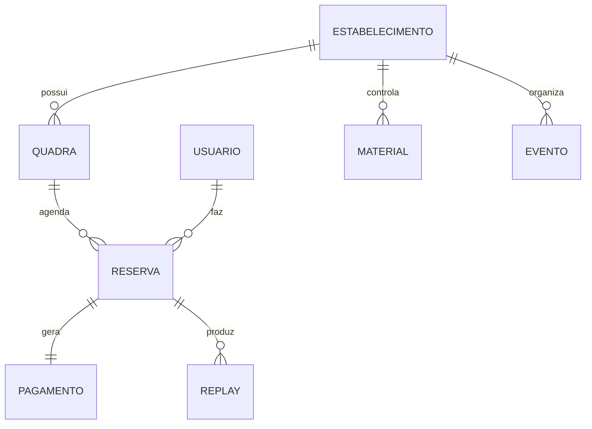

# Arquitetura e Stack — v3 (produção)

> Decisão: stack **robusta, de mercado e estruturada** (frameworks opinativos, mensageria, cloud e storage de ponta), conteinerizada com **Docker**, mobile em **Flutter**, pagamentos via **AbacatePay**, **cloud AWS desde o início** com **Cloudflare** na borda. Cada frente tem **uma escolha definitiva** (sem "ou" — alternativas viram ADR). O TCC entrega um **recorte (MVP)** desta visão — ver [§14](#14-recorte-do-tcc-mvp-vs-visão-completa).
> Projeto **open source — AGPL-3.0 (open-core)**: ver [Código Aberto, Licença e Projeções](codigo-aberto.md). Embasamento em [Fundamentação Teórica e Padrões](fundamentacao.md); segurança/LGPD em [Segurança, Privacidade e LGPD](seguranca-lgpd.md); requisitos em [Requisitos](requisitos.md); decisões em [Decisões de Arquitetura (ADRs)](adr/README.md); pastas em [Estrutura do Monorepo](estrutura-monorepo.md).

## 1. Visão geral
Arquitetura **cliente-servidor** com web, app mobile e um **back-end de API** central, banco relacional, cache/filas, storage de mídia e integrações externas (pagamento, WhatsApp, vídeo, push). Borda na **Cloudflare** (DNS, CDN, WAF); infraestrutura na **AWS**.



## 2. Stack por camada
| Camada | Tecnologia | Por quê (padrão de mercado) |
|---|---|---|
| **Web** | Next.js 15 (App Router) · TypeScript · Tailwind · shadcn/ui | SSR/RSC, ecossistema maduro, design system em código |
| **Estado web** | TanStack Query (server) + Zustand (UI) · React Hook Form + Zod | separação server/UI state, validação tipada |
| **Tabelas/relatórios (UI)** | TanStack Table · Recharts | grids ricos + gráficos do painel |
| **Mobile** | **Flutter (Dart 3)** · Riverpod · go_router · Dio | app nativo iOS/Android com 1 base; clean architecture |
| **Back-end/API** | **NestJS** (Node + TS) · REST + OpenAPI/Swagger | framework modular, DI, opinativo e testável |
| **ORM/DB** | **PostgreSQL** + **Prisma** (migrations) | relacional combina com reservas; ORM tipado |
| **Cache/Filas** | **Redis** + **BullMQ** | jobs assíncronos (lembretes, processar replay, e-mail) |
| **Auth** | JWT (access+refresh) · Passport · OAuth social (Google/IG) | padrão de mercado — detalhe em [Segurança, Privacidade e LGPD](seguranca-lgpd.md) |
| **Pagamentos** | **AbacatePay** (Pix) + cartão · confirmação por **webhook** | gateway BR focado em Pix |
| **Notificações** | WhatsApp Cloud API · **Push (FCM/APNs)** · e-mail (**AWS SES**) · in-app | multicanal, assíncrono via fila |
| **Mídia/Replays** | upload → **AWS S3** · transcode → **MediaConvert** · entrega → **CloudFront** | VOD AWS-native (**IVS** p/ live, futuro) |
| **Realtime** | WebSocket (NestJS Gateway + **Socket.IO**) | disponibilidade de horários ao vivo |
| **Cloud/Infra** | **AWS** (ECS Fargate, ECR, RDS, ElastiCache, S3, CloudFront, SES, CloudWatch, Secrets Manager) + **Cloudflare** (DNS/WAF/Registrar) | infra gerenciada, escalável — **desde o início** |
| **Design → código** | Figma (Variables/Styles) → **Style Dictionary** | tokens exportados p/ Tailwind **e** Flutter |

## 3. Método de definição da stack (padrões)
Não escolher por hype — escolher por critério e **registrar a decisão**.
- **Matriz de critérios** por tecnologia: aderência ao requisito · maturidade/comunidade · ecossistema/libs · curva de aprendizado · custo · escalabilidade · suporte a **dev assistido por IA**.
- **ADR — Architecture Decision Records:** cada decisão de stack/arquitetura vira um arquivo em `docs/adr/NNNN-titulo.md` (contexto → decisão → consequências). Lista inicial em [§16](#16-adrs-iniciais-a-registrar).
- **Requisitos guiam a stack:** os **RNF** (segurança, LGPD, disponibilidade, performance) determinam infra e escolhas — não o contrário.
- **12-Factor App:** config por env, build/release/run separados, stateless, logs como stream, paridade dev/prod. Base teórica em [Fundamentação Teórica e Padrões](fundamentacao.md).

## 4. Padrões de arquitetura e projeto
- **Back-end (NestJS):** **modular por domínio** + camadas `controller → service → repository`, **DTOs + validação** (class-validator), **eventos de domínio**. Inspiração **Clean/Hexagonal** (domínio isolado de infra).
  - Módulos: `auth · usuarios · estabelecimentos · quadras · reservas · pagamentos · notificacoes · replays · relatorios`.
- **API:** REST **versionada** (`/api/v1`), documentada por **OpenAPI/Swagger**; **webhooks** (AbacatePay, WhatsApp) com verificação de assinatura; idempotência em operações de pagamento.
- **Web:** organização **feature-based**, Server Components por padrão, Client só quando há interatividade.
- **Mobile (Flutter):** **clean architecture** (`data / domain / presentation`) + Riverpod.
- **Detalhamento teórico** (SOLID, padrões GoF, REST/Richardson, clean code): [Fundamentação Teórica e Padrões](fundamentacao.md).

## 5. Integração app ↔ web ↔ API
Um só back-end serve os dois clientes — **contrato único** evita divergência.
- **Contrato compartilhado:** tipos e schemas **Zod** em `packages/shared`; o cliente HTTP do front é gerado/tipado a partir do **OpenAPI** da API (uma fonte de verdade).
- **Sessão única:** mesmo modelo de auth (JWT access+refresh) no web e no Flutter; refresh transparente.
- **Deep links / Universal Links:** abrir tela específica do app a partir de link do site (ex.: `rally://reserva/123` / `https://rally.app/r/123`); fallback p/ web se o app não estiver instalado.
- **Realtime comum:** mesmo gateway WebSocket para disponibilidade de horários nos dois clientes.
- **Paridade de telas:** toda tela do app tem equivalente na web (ver Telas e Fluxos).

## 6. Notificações (multicanal)
Disparadas por **eventos de domínio** e processadas em **fila (BullMQ)** — nunca no caminho síncrono da request.
- **WhatsApp Cloud API** — confirmação de reserva, lembrete (cron), replay pronto, promoções (opt-in).
- **Push** — **FCM** (Android) / **APNs** (iOS) no Flutter via Firebase Messaging; web push opcional.
- **E-mail** — **AWS SES** (transacional/escala) ou Resend; recibos, recuperação de senha, relatórios.
- **In-app** — central de notificações (tela já desenhada) alimentada pela API.
- **Preferências por usuário** (canais on/off) e respeito a opt-out/LGPD para marketing.

## 7. Relatórios, tabelas e exportação
- **No painel:** KPIs e gráficos (Recharts) + tabelas (TanStack Table) com filtro/ordenção/paginação server-side.
- **Exportação "planilha":** **CSV/XLSX** (lib `exceljs`/`SheetJS`) e **PDF** para relatórios financeiros/ocupação — gerados em worker e disponibilizados via link S3 temporário.
- **Integração opcional:** export para **Google Sheets** (API) para donos que preferem planilha viva.
- **Agregações** no banco (views/SQL) + cache Redis para relatórios pesados.

## 8. Design como código (Figma → produção)
- **Fonte de verdade visual:** arquivo Figma com **Variables, Color/Text Styles e Component Sets** (já construído) + [DESIGN.md (raiz do repo)](../DESIGN.md) + skill `rally-design-system`.
- **Pipeline de tokens:** Variables do Figma → **Style Dictionary** → saídas para **Tailwind** (web) e **tema Dart** (Flutter). Uma mudança de token propaga para os dois apps.
- **Componentização:** web em `packages/ui` (shadcn + tokens); Flutter com widgets equivalentes.
- **Acessibilidade** embutida no design system (WCAG AA) — ver [Fundamentação Teórica e Padrões](fundamentacao.md) §acessibilidade.

## 9. Estrutura de pastas (monorepo)
**Turborepo + pnpm** para web/API/pacotes; Flutter como app próprio.
```
rally/
├─ apps/
│  ├─ web/            # Next.js (site + painel + landing)
│  ├─ api/            # NestJS (REST + workers)
│  │  └─ src/modules/{auth,reservas,pagamentos,...}/
│  └─ mobile/         # Flutter (Dart) — clean arch
├─ packages/
│  ├─ shared/         # tipos, schemas Zod, contratos da API
│  ├─ ui/             # componentes web (shadcn + tokens Rally)
│  ├─ tokens/         # Style Dictionary (Figma → Tailwind/Flutter)
│  └─ config/         # eslint, tsconfig, tailwind preset
├─ docs/
│  ├─ adr/            # decisões de arquitetura (ADRs)
│  └─ DESIGN.md       # design system (tokens) → ver vault
├─ infra/             # Dockerfiles, docker-compose, IaC (Terraform)
├─ .github/workflows/ # CI/CD
├─ docker-compose.yml # web + api + postgres + redis (dev)
├─ commitlint.config.js · .husky/   # padronização de commits
└─ turbo.json
```

## 10. Cloud & Infraestrutura (AWS + Cloudflare) — desde o início
**AWS** é a nuvem **desde o dia 1** (sem etapa intermediária); **Cloudflare** na borda. Provisionada por **Terraform** (IaC).
| Função | Serviço (definitivo) | Observação |
|---|---|---|
| Compute (API/workers) | **AWS ECS Fargate** (container Docker) atrás de **ALB** | sem gerenciar servidor; escala horizontal |
| Registry de imagem | **Amazon ECR** | imagens Docker versionadas |
| Web (Next.js) | **AWS via SST/OpenNext** (Lambda + CloudFront + S3) | Next.js serverless AWS-native (sem Vercel) |
| Banco | **AWS RDS (PostgreSQL 16, Multi-AZ)** | alta disponibilidade, backups + PITR |
| Cache/Filas | **AWS ElastiCache (Redis 7)** | cache + BullMQ |
| Storage | **AWS S3** | uploads, replays, exports (URLs assinadas) |
| Vídeo (VOD) | **MediaConvert** (transcode) + **CloudFront** | replays; **IVS** p/ live no futuro |
| CDN | **CloudFront** | mídia e assets estáticos |
| E-mail | **AWS SES** | transacional em escala |
| Segredos/config | **AWS Secrets Manager** + **SSM Parameter Store** | nunca em código |
| Observabilidade | **CloudWatch** (logs/métricas/alarmes) + **Sentry** + **OpenTelemetry** | rastreio ponta a ponta |
| Borda/DNS/WAF | **Cloudflare** | DNS, CDN, WAF, rate limit, TLS, proteção DDoS |
| Registro de domínio | **Cloudflare Registrar** (.com) + **Registro.br** (.com.br) | domínio do produto |
> Em **dev**, tudo roda local via **Docker Compose** (paridade dev/prod — 12-Factor). O provisionamento AWS é versionado em `infra/` (Terraform) e aplicado pelo CI.

## 11. DevOps, CI/CD e padronização
- **Containerização:** **Docker** + `docker-compose` no dev (web, api, postgres, redis) → ambiente reproduzível e paridade com produção.
- **IaC (opcional/overengineering):** **Terraform** versionando a infra AWS.
- **CI/CD — GitHub Actions:** pipeline `lint → typecheck → test → build → docker build → deploy`, com **migrations Prisma** como gate; ambientes **preview / staging / produção**; deploy automático no merge.
- **Padronização de commits:** **Conventional Commits** (`feat:`, `fix:`, `chore:`...) validado por **commitlint** + **Husky** (hook) + **lint-staged**; versionamento **SemVer** e CHANGELOG via **changesets**/semantic-release.
- **Branching:** *trunk-based* / GitHub Flow (branches curtas + PR + review obrigatório); templates de PR; **CODEOWNERS**.
- **Qualidade automatizada:** ESLint + Prettier, **Jest** (unit) + Supertest (API e2e) + **Playwright** (web e2e) + `flutter_test`; cobertura mínima no CI; **Dependabot/Renovate** (atualizações) e **Snyk/CodeQL** (scan de segurança).
- **Observabilidade:** **Sentry** (erros) · logs estruturados (**pino**) → CloudWatch · uptime/health checks · *(opc.)* métricas Prometheus + Grafana.

## 12. IA & Skills no desenvolvimento
- **Ferramentas:** **Cursor** + **Claude Code**, com **CLAUDE.md** e **DESIGN.md** na raiz de cada app dando contexto; **`.cursor/rules`** apontando para o DESIGN.md.
- **Skill `rally-design-system`** — gera telas/componentes no padrão (tokens, acessibilidade).
- **MCP (Model Context Protocol):** servidores como o **Figma MCP** (gerar/editar UI), além de conectores de banco/issues — contexto vivo para os agentes.
- **Extensões de IDE úteis:** ESLint, Prettier, Tailwind IntelliSense, Prisma, Error Lens, GitLens, Dart/Flutter; Copilot opcional como complemento ao Cursor/Claude.
- **IA aplicada a:** scaffolding de módulos NestJS, componentes a partir dos tokens, testes, ADRs e revisão de código. Cada fase do Roadmap vira issues geradas com contexto do vault.

## 13. Requisitos (resumo)
**Funcionais (RF):** cadastro/login (cliente, equipe) · gestão de quadras/horários/preços · busca e **reserva** com disponibilidade em tempo real · **pagamento** Pix/cartão · confirmação/lembrete (WhatsApp/push/e-mail) · painel de gestão · usuários e permissões (RBAC) · relatórios e **exportação** · **replays** dos jogos · promoções/cupons · eventos.
**Não-funcionais (RNF):** segurança e **LGPD** ([Segurança, Privacidade e LGPD](seguranca-lgpd.md)) · disponibilidade e tolerância a falha · performance (reserva sem conflito — controle de concorrência) · escalabilidade (filas/CDN) · observabilidade · responsivo (web) e nativo (mobile) · acessibilidade WCAG AA.
> Detalhar depois em `Requisitos.md` (casos de uso + RNF mensuráveis).

## 14. Recorte do TCC (MVP) vs visão completa
A visão acima é a **meta de produto**. Para o TCC, recorte realista pra entregar no prazo:

| Entra no MVP (TCC) | Fica como "trabalhos futuros" |
|---|---|
| Web + API + PostgreSQL na **AWS (ECS/RDS/S3) + Docker** desde o início | App **Flutter** completo |
| Auth + cadastro de quadras + **agendamento** + painel | **Replays** (câmera/MediaConvert/streaming) |
| **Pagamento Pix (AbacatePay)** + webhook | Push/WhatsApp em produção · **EKS / multi-região / OpenSearch** |
| Relatórios básicos + exportação CSV + Git/CI | Multi-estabelecimento / clubes / IA nos replays |

> Honestidade de escopo: a stack inteira é ambiciosa para um técnico. O MVP acima já demonstra **arquitetura de mercado** (NestJS modular + Prisma + Docker + Pix real + CI/CD) e cabe na banca; o resto entra como evolução documentada.

## 15. Modelo de dados (entidades principais)
- **Estabelecimento** · **Quadra** · **Modalidade** · **Usuário** (cliente + papéis de gestão) · **Reserva** · **Pagamento** · **Material** · **Promoção/Cupom** · **Evento/Torneio** · **Replay/Clipe** · *(futuro)* **Jogador, Time, Plano/Mensalidade, Aula**.



## 16. ADRs iniciais a registrar
1. **NestJS** como back-end (vs Next API routes) — estrutura, DI, testabilidade.
2. **Flutter** no mobile (vs React Native) — nativo iOS/Android com 1 base.
3. **AbacatePay** como gateway (vs Stripe/Mercado Pago) — Pix BR.
4. **PostgreSQL + Prisma** — relacional + migrations tipadas.
5. **AWS** como cloud + **Cloudflare** na borda (vs all-Cloudflare / Supabase) — escala e padrão de mercado.
6. **S3 + MediaConvert + CloudFront** para replays — storage + transcode + entrega (IVS p/ live).
7. **Turborepo (monorepo)** — web/api/shared juntos.
8. **Conventional Commits + Trunk-based** — padronização de histórico e fluxo.
9. **Licença AGPL-3.0 (open-core)** — código aberto que protege o SaaS (ver [Código Aberto, Licença e Projeções](codigo-aberto.md)).
10. **Deploy AWS-native (SST/OpenNext + ECS Fargate)** — AWS desde o início.

> Todos detalhados em [Decisões de Arquitetura (ADRs)](adr/README.md).
