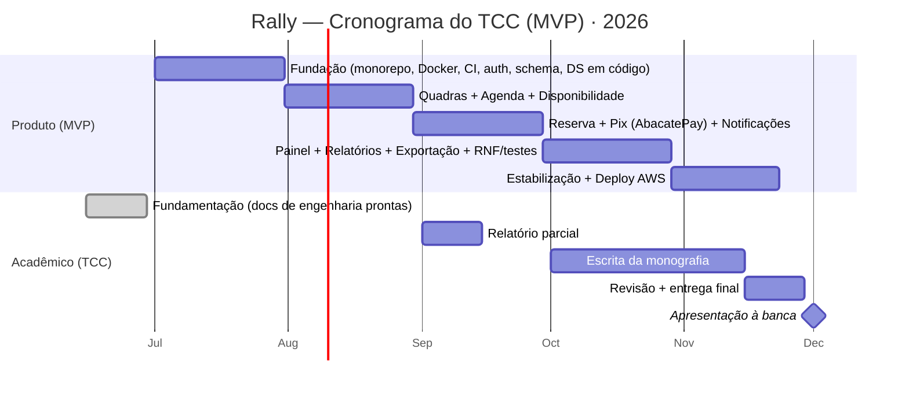

# Cronograma do TCC (Roadmap → MVP)

> Amarra a **Fase 0 (Fundação/TCC)** do Roadmap às entregas do **MVP** (RF *Must* de [Requisitos](requisitos.md)), num calendário realista para um técnico entregar em 2026. As fases 1–4 ficam como **pós-TCC** (produto). 
> ⚠️ **Datas são propostas** — ajustar ao calendário oficial de **Projetos II / IFSul** (entregas parciais e banca). Hoje: 2026-06-22.

## Visão geral

## Marcos (produto) × entregas do MVP
| Marco | Período (proposto) | Entrega | RF/RNF cobertos |
|---|---|---|---|
| **M0 — Base pronta** | concluído (jun) | Documentação de engenharia (stack, requisitos, ADRs, schema, governança) | — (fundamentação) |
| **M1 — Fundação técnica** | jul/2026 | Monorepo + Docker + **CI**; **auth** (login/cadastro + RBAC); migrations Prisma + seed; design system em código | RF-01,02 · RNF-06,13 |
| **M2 — Quadras & agenda** | ago/2026 | Cadastro de quadras/preços; **agenda** (criar/mover/bloquear); **disponibilidade em tempo real** | RF-05,06,07,20,21 · RNF-01,03 |
| **M3 — Reserva & pagamento** | set/2026 | Fluxo de **reserva** + **Pix (AbacatePay)** + **webhook** idempotente; confirmação/notificação | RF-08,09,12,13,16 · RNF-10 |
| **M4 — Gestão & relatórios** | out/2026 | Painel (ocupação/receita); **usuários & permissões**; relatórios + **exportação CSV**; testes e acessibilidade | RF-22,23,27,28 · RNF-04,07,08,12 |
| **M5 — Estabilização & deploy** | nov/2026 | Deploy **AWS** (ECS/RDS/S3) + Cloudflare; hardening, observabilidade; congelar escopo | RNF-04,05,11 |

> Cada marco = ~1 mês / 2 sprints quinzenais. **Definition of Done** por marco em [Governança e Gestão (Tecnologia, Design, Código)](governanca.md) (§4).

## Trilha acadêmica (Projetos II)
| Entrega | Quando (propor) | Base no vault |
|---|---|---|
| Anteprojeto / proposta | (conforme calendário) | Visão e Posicionamento · Escopo e Funcionalidades |
| Fundamentação teórica | já redigível | [Fundamentação Teórica e Padrões](fundamentacao.md) · [Arquitetura e Stack](arquitetura.md) |
| Requisitos & modelagem | já redigível | [Requisitos](requisitos.md) · [Modelo de Dados (schema.prisma)](modelo-de-dados.md) · [Decisões de Arquitetura (ADRs)](adr/README.md) |
| Relatório parcial | set/2026 | progresso M1–M2 + prints |
| Monografia (final) | out–nov/2026 | todos os docs + resultados do MVP |
| Apresentação/banca | ~dez/2026 | demo do MVP + slides |

## Como amarra ao Roadmap
- **Fase 0 (Fundação/TCC)** = MVP acima → **é o entregável do TCC**.
- **Fase 1 (Produto)**, **2 (Replays)**, **3 (Eventos)**, **4 (Clubes)** = **trabalhos futuros**, citados na monografia como evolução (já documentados — sustentam o "tem visão de produto").

## Riscos do prazo (e folga)
- **Pagamento real (AbacatePay)** pode atrasar por homologação → começar a integração em **M2** (antes de M3) como spike.
- **Replays** **não** estão no MVP (alto custo) — mantê-los fora protege o prazo.
- Reservar **nov** para estabilização e escrita; não empilhar feature nova em cima da banca.
- Se apertar, cortar por prioridade **MoSCoW** ([Requisitos](requisitos.md)): mantém *Must*, sacrifica *Should/Could*.

> Conexões: Roadmap · [Requisitos](requisitos.md) · [Arquitetura e Stack](arquitetura.md) · [Governança e Gestão (Tecnologia, Design, Código)](governanca.md) · Rally - Hub do Projeto.
